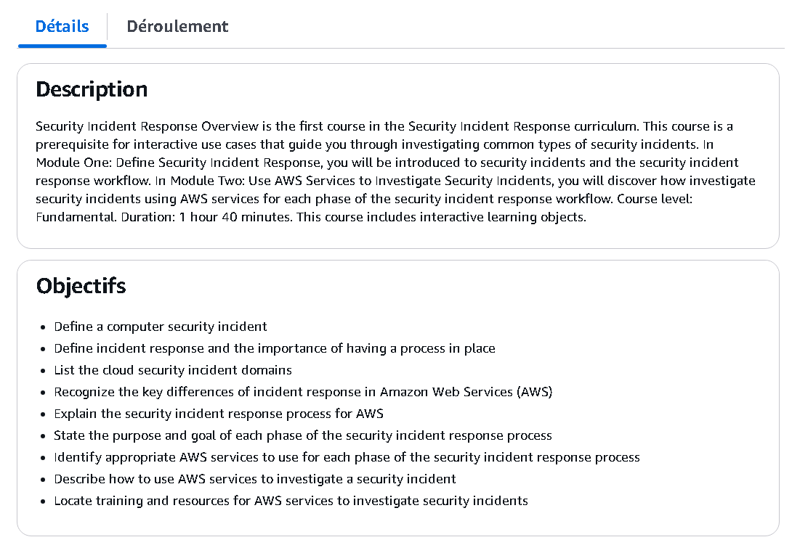
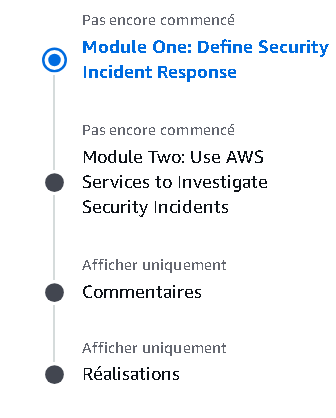
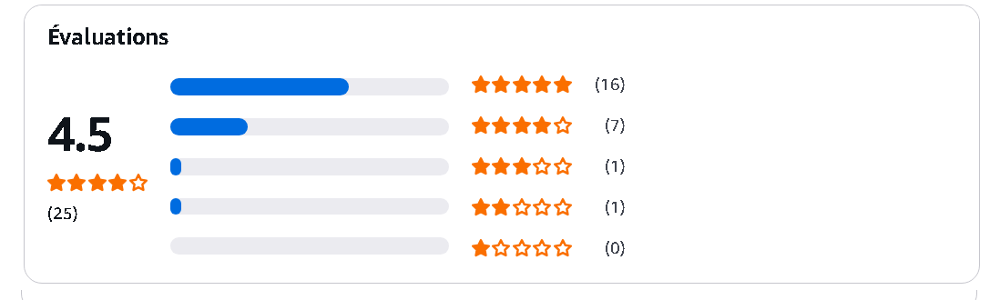

# 🛡️ AWS Security Incident Response Overview

This repository contains **notes, labs, playbooks, workshops, case studies, and certificate of completion** for the *AWS Security Incident Response* program.  
The course focuses on **AWS cloud security, incident response lifecycle, threat detection, and compliance best practices**.

---

## 📚 Notes  

- 📄 [`01-introduction.md`](./notes/01-introduction.md) – Introduction to AWS IR  
- 📄 [`02-incident-response-fundamentals.md`](./notes/02-incident-response-fundamentals.md) – IR lifecycle & fundamentals  
- 📄 [`03-preparation-phase.md`](./notes/03-preparation-phase.md) – Preparation & playbooks  
- 📄 [`04-detection-and-analysis.md`](./notes/04-detection-and-analysis.md) – Detection strategies & log analysis  
- 📄 [`05-containment.md`](./notes/05-containment.md) – Containment methods in AWS  
- 📄 [`06-eradication.md`](./notes/06-eradication.md) – Eradication techniques & mitigation  
- 📄 [`07-recovery.md`](./notes/07-recovery.md) – Recovery & system restoration  

---

## 🧪 Labs  

- 🔍 [`aws-ir-playbooks.md`](./labs/aws-ir-playbooks.md) – Playbooks for AWS incidents  
- ⚡ [`detection-response-labs.md`](./labs/detection-response-labs.md) – Detection & response hands-on labs  
- 🌐 [`hands-on-scenarios.md`](./labs/hands-on-scenarios.md) – AWS IR simulation scenarios  

---

## 📋 Playbooks  

- ✅ [`aws-ir-playbooks.md`](./labs/aws-ir-playbooks.md) – Step-by-step incident response playbooks  

---

## 🏫 Workshops  

- 🛠️ [`aws-incident-response-workshop.md`](./workshops/aws-incident-response-workshop.md) – AWS IR workshop overview  
- 🔎 [`forensics-lab-notes.md`](./workshops/forensics-lab-notes.md) – Forensics lab notes  
- ⚔️ [`threat-hunting-session.md`](./workshops/threat-hunting-session.md) – Threat hunting exercises  

---

## 🔬 Research / Extras  

- 📑 [`case-studies.md`](./extras/case-studies.md) – Analyzed AWS IR case studies  
- 📚 [`resources.md`](./extras/resources.md) – References & AWS security resources  
- 📆 [`timeline.md`](./extras/timeline.md) – Timeline of attacks & responses  

---

## 📖 Docs  

- 📘 [`glossary.md`](./docs/glossary.md) – AWS IR & cloud security glossary  
- 📘 [`index.md`](./docs/index.md) – Program overview  
- 📘 [`references.md`](./docs/references.md) – External references & documentation  
- 📘 [`roadmap.md`](./docs/roadmap.md) – Learning roadmap  
- 📘 [`syllabus.md`](./docs/syllabus.md) – Course syllabus  

---

## 📸 Screenshots  

| Step                   | Screenshot |
|------------------------|------------|
| 🏫 Course Description   |  |
| 📘 Module Overview      |  |
| ⭐ Course Review         |  |

---

## 📜 Certificate  

🎓 [`AWS Security Incident Response`](./cert/17875_5_6459463_1729418889_AWS%20Skill%20Builder%20Course%20Completion%20Certificate.pdf)  

---

## 📝 Personal Review  

This course provided me with a comprehensive **understanding of AWS cloud security and incident response**.  
The **hands-on labs and playbooks** gave practical experience in detecting, containing, and mitigating incidents.  
Workshops on **forensics and threat hunting** further strengthened my skills in real-world scenarios.  

Overall, this program is an excellent starting point for anyone aiming to **master AWS incident response and cloud security fundamentals**.

---

## ✍️ Author  

**Thành Danh** – Red Team Learner & Security Researcher  

- GitHub: [@ngvuthdanhh](https://github.com/ngvuthdanhh)  
- Email: ngvu.thdanh@gmail.com   

---

## 📄 License  

This project is licensed under the terms of the **MIT License**.  
See [`LICENSE`](./LICENSE) for full details.  

© 2025 ngvuthdanhh. All rights reserved.  
